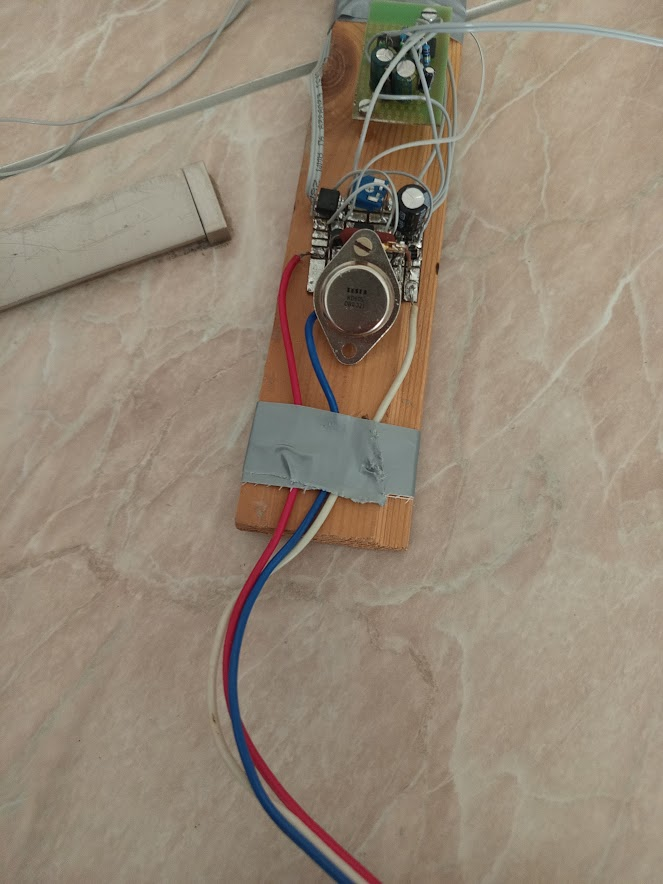
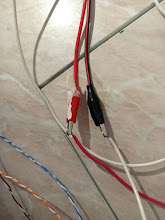
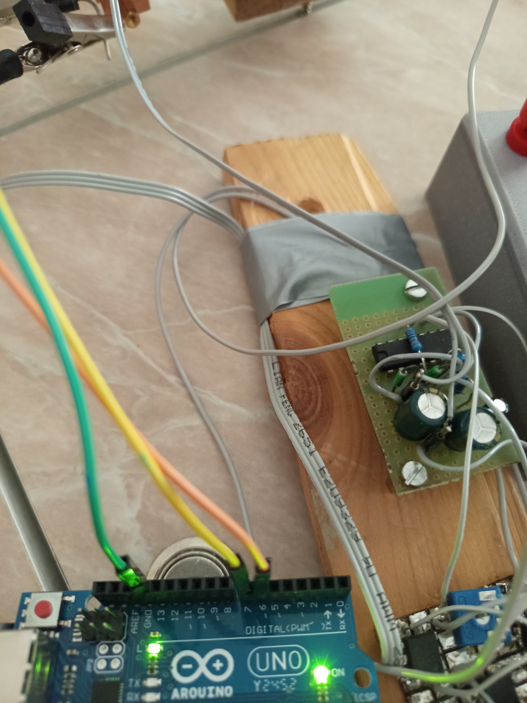
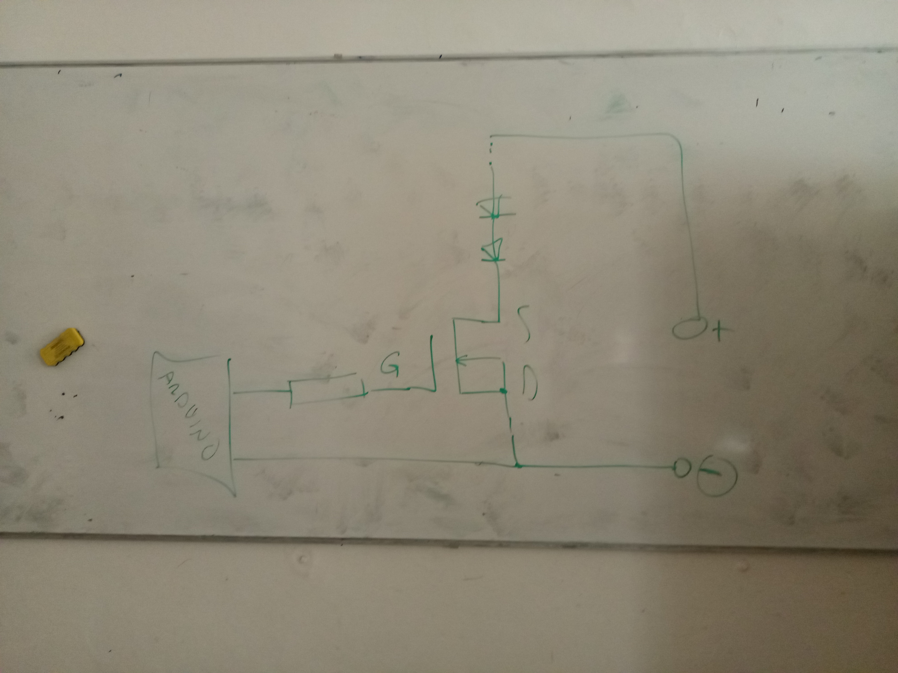

# Jiskřič

## Zdroj
- cca 3V
- cca 1A
- červená -> plus zdroje
- modrá -> minus zdroje
## Jiskřič
- bílá -> černý banánek
- červená -> červený banánek  

# Senzor plamene
- informuje o změně teploty (jde otestovat déchnutím teplého vzduchu)
- dva drátky z senzoru zapojte do děr na destičce, nezáleží na polaritě
- napájení batrkou cca 6v (4 x 1.5V)
- zelený kabel -> `GND` arduina
- žlutý kabel (senzor HIGH/LOW) -> pin `7` arduina (`FLAME_SENSOR_PIN`)
- oranžový kabel (sepnutí jiskřiče HIGH/LOW) -> pin `6` arduina  (`LIGHTER_PIN`)

# Termistory

| Barva u termistoru | Pozice       | Pin Arduina | Barva u Arduina |
|--------------------|--------------|-------------|-----------------|
| Zelená             | u senzoru    | A2          | Oranžová        |
| Modrá              | u zapalovače | A3          | Žlutá           |
| Oranžová           | uprostřed    | A1          | Hnědá           |
| Hnědá              | místnost     | A0          | Černá           |

- zelenená -> `GND` arduina
- červená -> `5V` arduina
- piny v `THERMISTOR_PINS`
- [datasheet](https://img.gme.cz/files/eshop_data/eshop_data/2/118-042/dsh.118-042.1.pdf) ze kterýho jsem dostal data pro přepočítání odporu na teplotu
- při vypisování arduinem jsou v pořadí: `zapalovač, střed, senzor, místnost`

# Diody

plus zdroje => diody => source tranzistoru (žlutý kabel) => drain tranzistoru (zelený kabel) => minus zdroje  

## Zdroj
- cca 26.5V (1V na diodu x 26)
- max 3A, proud určuje rychlost zahřívání, ale také způsobí, že termostat víc přestřelí

## Arduino
- zelený drátek => `GND` arduina
- hnědý drátek => pin `3` arduina (HEATER_PIN)

# Nákresy zapojení
